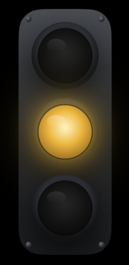
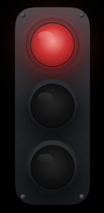
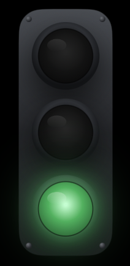

# Claude Code Traffic Light

A tiny macOS widget that shows what Claude Code is doing right now as a traffic
light — floating on your desktop and mirrored in the menu bar.

<p align="center">
  
  
  
</p>

| Colour | State | Meaning |
| --- | --- | --- |
| 🟡 Yellow | `working` | Claude is working (thinking, running tools) |
| 🔴 Red | `waiting` | Claude needs you — an **Allow/Deny** prompt or a **choose-an-option** question |
| 🟢 Green | `done` | Claude finished its turn |
| ⚪ Grey | `idle` | No active session |

## Install

1. **Download** `ClaudeTrafficLight.zip` from the [Releases](../../releases) page and unzip it.
2. **Double-click** `ClaudeTrafficLight.app` right there in Downloads — macOS will block it (the app isn't signed with a paid Apple Developer ID). Close the dialog.
3. Open **System Settings → Privacy & Security**, scroll down → click **Open Anyway** → confirm. The app starts.
4. Quit the app and **move** `ClaudeTrafficLight.app` to `/Applications`, then open it from there.
5. Click the **Claude sunburst icon in the menu bar** → **Install Hooks** — this connects the widget to Claude Code.
6. **Fully restart Claude Code.** Done — the light now reacts to your sessions.

> Order matters: unblock the app **while it's still in Downloads** (steps 2–3), and only then move it to `/Applications`. Once it's there, macOS needs an extra "App Management" permission to unblock it.
>
> If the **Open Anyway** button doesn't appear in step 3, unblock from the terminal instead:
> `xattr -dr com.apple.quarantine ~/Downloads/ClaudeTrafficLight.app`

That's it — start a Claude Code session and the light will react.

### Menu options

- **Size** — Small / Medium / Large
- **Launch at Login** — start the widget automatically after you log in
- **Install / Reinstall Hooks** — set up (or repair) the Claude Code integration
- **Uninstall Hooks** — remove everything the app added (your own hooks and
  settings are left untouched); after that you can simply delete the app
- **Show / Hide Widget** — toggle the desktop light
- **Quit**

## How it works

Claude Code can run shell commands on lifecycle **hooks**. "Install Hooks" adds a
tiny script (`~/.claude/traffic-light.sh`) to those hooks; the script writes the
current state to a per-session file under `~/.claude/status/`, and the app watches
that folder and colours the light.

```
Claude Code ──(hook fires)──▶ ~/.claude/traffic-light.sh ──writes──▶ ~/.claude/status/<session>.json
                                                                                 │
                                                                     app watches folder (polls)
                                                                                 ▼
                                                                 traffic light (desktop + menu bar)
```

Hook → state mapping:

| Hook | Fires when… | State |
| --- | --- | --- |
| `UserPromptSubmit` | you send a prompt | 🟡 working |
| `PreToolUse` | Claude is about to use a tool | 🔴 waiting* |
| `PostToolUse` | a tool finished | 🟡 working |
| `Stop` | Claude finished its turn | 🟢 done |
| `SessionEnd` | a session ends | removes that session |

\* `PreToolUse` fires for **every** tool, but the app **debounces** it: red only
appears if the wait lasts longer than ~0.5 s. Fast auto-approved commands never
flash red — only real Allow/Deny prompts and questions (which block until you
act) turn the light red.

## Build from source (alternative)

If you'd rather build it yourself:

```bash
# 1) wire up the hooks (or use the in-app "Install Hooks" button later)
./scripts/install-hooks.sh   # then fully restart Claude Code

# 2) build
xcodebuild -project ClaudeTrafficLight.xcodeproj -scheme ClaudeTrafficLight -configuration Release build

# to remove everything later (also available as a menu button):
./scripts/uninstall-hooks.sh
```

Or just open `ClaudeTrafficLight.xcodeproj` in Xcode and Run. For everyday use,
launch the built `.app` on its own rather than under the Xcode debugger.

The app is **tool-agnostic** — it only watches `~/.claude/status/`. Anything
that writes `working` / `waiting` / `done` per session there drives the light.
To use it with another agent, point that tool's event/notification mechanism at
`traffic-light.sh`:

## Notes

- The app is **not sandboxed** so it can read `~/.claude/status/`.
- **Multiple sessions:** each gets its own status file; the light shows the most
  urgent state (🔴 waiting > 🟡 working > 🟢 done) and the menu lists every live
  session by project. Ended sessions are removed via `SessionEnd`, with a
  30-minute timeout as a backstop for crashes.
- The menu-bar mark reuses the installed Claude app's tray icon if present,
  otherwise it draws its own. Requires macOS 14+.
